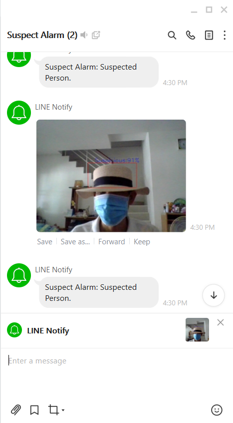

# Suspect-Alarm

​	Suspect-Alarm เป็นระบบเตือนภัยโดยเน้นที่ห้างทอง ธนาคาร และร้านสะดวกซื้อ โดยผู้ที่มาใช้บริการต้องเปิดเผยใบหน้า หากมีการปิดบังใบหน้าระบบ
จะถ่ายภาพและแจ้งเตือนผ่าน application LINE  อัตโนมัติ รูปที่บันทึกจะบันทึกแยกโฟลเดอร์ตาม ปี เดือน และวันที่ ชื่อรูปจะเป็นตัวเลขโดยจะเรียงจาก 

ปี เดือน วัน ชั่วโมง นาที วินาที 

เช่น 20200901155213.jpg

ซึ่งสามารถตั้งค่าการตรวจจับได้เป็นเปอร์เซ็นต์ค่าเริ่มต้นอยู่ที่ 90% ขึ้นไป

<video controls="controls" style="zoom:50%;">   <source type="video/mp4" src="Suspicious.mp4"></source>
Your browser does not support the video element.
 </video>

สำหรับ ไฟล์ yolov3-obj_2400.weights โหลดไฟล์ที่ google drive ครับ
https://drive.google.com/file/d/1qV807gzDRuM27PwIoarGX-zazhXH4JJz/view?usp=sharing
การเตือนจะต้องสร้างกลุ่ม line แล้วสร้าง token ใส่ในโค้ดโปรแกรม หรือทดลองเข้ากลุ่ม Suspect Alarm ที่สร้างไว้แล้ว

 https://line.me/R/ti/g/0qeUzHZV-7

